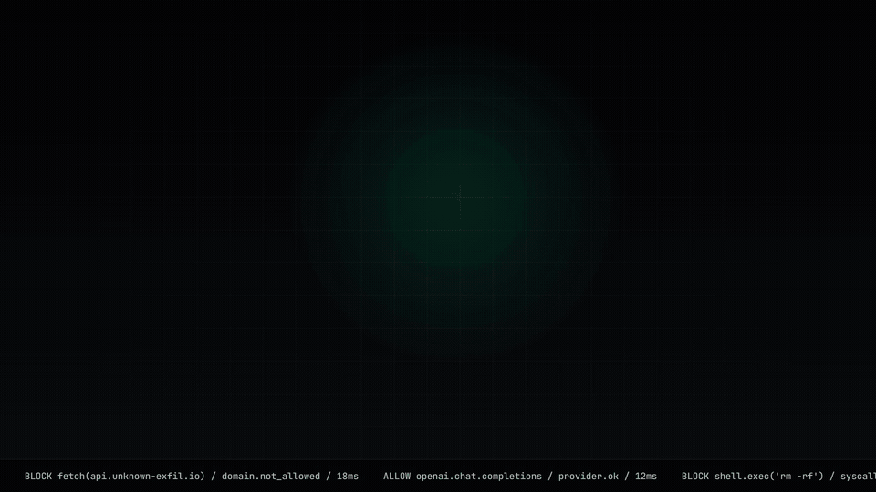
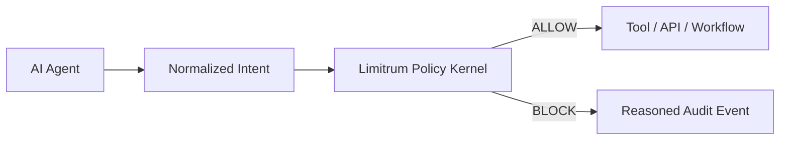

<p align="center">
  <picture>
    <source media="(prefers-color-scheme: dark)" srcset=".github/assets/limitrum-logo-white.png">
    <source media="(prefers-color-scheme: light)" srcset=".github/assets/limitrum-logo-dark.png">
    
  </picture>
</p>

<h1 align="center">Limitrum</h1>

<p align="center">
  <strong>Policy kernel for autonomous AI agents.</strong>
</p>

<p align="center">
  Official site: <a href="https://limitrum.com">limitrum.com</a>
</p>

<p align="center">
  Verify sensitive AI actions before they touch money, data, infrastructure, or external APIs.
</p>

<p align="center">
  <a href="https://limitrum.com">Website</a>
  ·
  <a href="https://github.com/Jayden-Siete/Limitrum/releases/tag/v0.1.1">Release</a>
  ·
  <a href="https://www.npmjs.com/package/@limitrum/sdk">npm</a>
</p>

<p align="center">
  <a href="LICENSE"></a>
  <a href="https://www.npmjs.com/package/@limitrum/sdk"></a>
  <a href="SECURITY.md"></a>
  
  
</p>

<p align="center">
  
</p>

---

## What Limitrum Is

Agents are starting to execute real actions: charge customers, call APIs, mutate data, open tickets, run tools, and trigger workflows.

I am building Limitrum around a simple belief: autonomous agents should not be trusted only because a prompt says they will behave. Before an agent touches money, data, infrastructure, or an external API, there should be a deterministic policy layer outside the model.

Limitrum gives agents that hard runtime boundary:



This open-source repo includes the local policy kernel, SDK adapters, CLI, MCP server, and examples needed to evaluate actions deterministically. The goal is to make the core security primitive easy to inspect, test, and extend before teams decide to run it in production.

## Open-Core Boundary

This repository is the **open-source core**.

Included here:

- TypeScript policy kernel and SDK
- Local SQLite-backed policy and audit store
- CLI simulator
- MCP server for local tool enforcement
- OpenAI, Anthropic, and LangChain adapters
- Zero-cost local examples and tests
- Public marketing website

Not included here:

- Hosted Limitrum Cloud API
- Multi-tenant dashboard
- hosted API-key lifecycle
- team workspaces, RBAC, SSO, SCIM
- long-term audit retention
- SIEM export
- VPC / on-prem enterprise deployments
- billing, usage metering, and support tooling

See [docs/COMMERCIAL_BOUNDARY.md](docs/COMMERCIAL_BOUNDARY.md) for the product boundary.

## Why Developers Use It

- **Deterministic enforcement**: explicit rules return clear allow/block verdicts.
- **Runtime budgets**: cap daily spend, per-action cost, and request rate.
- **Tool boundary**: block dangerous actions such as unknown domains, process spawn, destructive mutations, and data exfiltration.
- **Audit trail**: every decision can be logged locally with the reason and guard that fired.
- **Agent-native**: wraps OpenAI, Anthropic, LangChain, MCP, and custom tool calls.

## Current Status

Limitrum is an alpha MVP. It is ready for developers to clone, run locally, inspect, and test against real agent-tool flows. The hosted cloud product is intentionally not part of this public repo yet; this repository is the foundation and proof of the policy-kernel model.

The fastest way to verify that the MVP works end to end:

```bash
pnpm smoke:mvp
```

## What To Try First

```bash
pnpm smoke:mvp
pnpm --filter @limitrum/cli dev simulate
pnpm --filter @limitrum/cli dev verify --agent-id agent_sales_01 --action fetch --target api.unknown-exfil.io --amount 1 --json
```

For the shortest integration path, see [docs/INTEGRATE_IN_5_MINUTES.md](docs/INTEGRATE_IN_5_MINUTES.md).

## Quickstart

### Option A: Install from npm

For an app that wants to integrate the SDK directly:

```bash
pnpm add @limitrum/sdk @limitrum/db
```

For the CLI:

```bash
pnpm add -D @limitrum/cli
pnpm exec limitrum simulate --requests 4 --amount 1
```

The standalone CLI bootstraps its local tables automatically. Use the repo setup below when you want the seeded `agent_sales_01` policy and the full allow/block verification path.

Published packages:

- [`@limitrum/sdk`](https://www.npmjs.com/package/@limitrum/sdk)
- [`@limitrum/db`](https://www.npmjs.com/package/@limitrum/db)
- [`@limitrum/cli`](https://www.npmjs.com/package/@limitrum/cli)
- [`@limitrum/mcp-server`](https://www.npmjs.com/package/@limitrum/mcp-server)

### Option B: Run the repo locally

#### 1. Install

```bash
git clone https://github.com/Jayden-Siete/Limitrum.git
cd Limitrum
pnpm install
```

#### 2. Prepare the local policy database

```bash
pnpm db:migrate
pnpm db:seed
```

#### 3. Run a local simulation

```bash
pnpm --filter @limitrum/cli dev simulate
```

The simulation creates a demo agent and runs repeated tool intents through the policy kernel without spending money on model calls.

#### 4. Verify real allow/block behavior

Allowed target:

```bash
pnpm --filter @limitrum/cli dev verify \
  --agent-id agent_sales_01 \
  --action openai.chat.completions.create \
  --target api.openai.com/v1/chat/completions \
  --amount 1
```

Blocked exfiltration target:

```bash
pnpm --filter @limitrum/cli dev verify \
  --agent-id agent_sales_01 \
  --action fetch \
  --target api.unknown-exfil.io \
  --amount 1
```

Machine-readable verdicts:

```bash
pnpm --filter @limitrum/cli dev verify \
  --agent-id agent_sales_01 \
  --action fetch \
  --target api.unknown-exfil.io \
  --amount 1 \
  --json
```

Use `--fail-on-block` when you want blocked verdicts to fail a CI step.

One-command MVP smoke test:

```bash
pnpm smoke:mvp
```

## SDK Example

```ts
import { LimitrumGuard } from "@limitrum/sdk";

const guard = new LimitrumGuard();

const verdict = await guard.verify({
  agentId: "billing-agent",
  action: "stripe.createCharge",
  target: "api.stripe.com/v1/charges",
  estimatedCostUsd: 50,
  metadata: {
    customerId: "cus_123",
    source: "agent.tool_call",
  },
});

if (!verdict.allowed) {
  throw new Error(`Blocked by ${verdict.guardTriggered}: ${verdict.reason}`);
}
```

## Repository Layout

```text
apps/
  cli/                 Local CLI simulator and policy tools
  mcp-server/          MCP tool server for local agent enforcement
  web/                 Public Limitrum website
  examples/
    yolo-agent/        Zero-cost OpenAI adapter simulation
    mcp-agent/         Zero-cost MCP client simulation
    protected-tool-call/
packages/
  db/                  SQLite schema, migrations, seed data
  sdk/                 Policy kernel, guards, adapters
tests/
  unit/                SDK and adapter tests
docs/
  ARCHITECTURE.md      Runtime model and guard flow
  COMMERCIAL_BOUNDARY.md
  HOW_LIMITRUM_WORKS_AND_TESTS.md
  INTEGRATE_IN_5_MINUTES.md
```

## MCP Server

Run Limitrum as an MCP tool server:

```bash
pnpm --filter @limitrum/mcp-server dev
```

Available tool:

- `limitrum_guard`: verifies an intent and returns an allow/block verdict.

SSE mode:

```bash
pnpm --filter @limitrum/mcp-server dev:sse
```

## Website

Official site: https://limitrum.com

```bash
pnpm --filter @limitrum/web dev
```

Production build:

```bash
pnpm --filter @limitrum/web build
```

## Quality Checks

```bash
pnpm typecheck
pnpm lint
pnpm test:unit
pnpm build
pnpm smoke:mvp
```

## Security

Please do not open public issues for vulnerabilities.

Report security issues through [SECURITY.md](SECURITY.md).

## License

The open-source core is MIT licensed. See [LICENSE](LICENSE).
