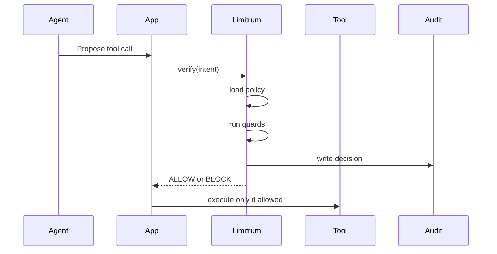

# Architecture

Limitrum is a policy decision point for autonomous AI agents.

Before an agent executes a sensitive action, the application converts the proposed action into an intent and asks Limitrum for a verdict.

## Runtime Flow



## Intent Shape

```ts
type VerifyIntentInput = {
  agentId: string;
  action: string;
  target: string;
  amount?: number;
  estimatedCostUsd?: number;
  metadata?: Record<string, unknown>;
};
```

## Guard Categories

- domain allowlist
- daily budget cap
- per-action cost cap
- rate limiting
- loop detection
- syscall and process-spawn protection
- destructive action blocking
- data exfiltration prevention
- prompt-injection pattern detection
- custom blocked patterns

## Decision Shape

```ts
type VerifyIntentResult = {
  allowed: boolean;
  decision: "allowed" | "blocked";
  reason: string;
  guardTriggered?: string;
  policyId?: string;
  cumulativeSpent: number;
  remainingBudget: number;
  latencyMs?: number;
};
```

## Modes

### Local Mode

Default open-source mode. `LimitrumGuard` reads policy from the local SQLite-backed store and writes local audit decisions.

### HTTP Client Mode

Optional client mode. If a `baseUrl` is provided, the SDK delegates verification to an external Limitrum-compatible API.

The hosted commercial API implementation is intentionally not part of this public repository.
